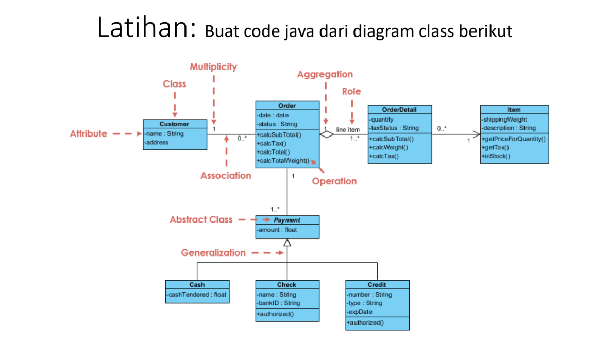

# Kardinalitas
## Praktikum Pertemuan Ke 11 Pemrograman Orientasi Objek.


<br>

| Variable           |             Isi            |
| -------------------|----------------------------|
| **Nama**           |         Fadil Aditya Adzima    |
| **NIM**            |          312310617         |
| **Kelas**          |          TI.23.A.6         |
| **Mata Kuliah**    |      Pemrograman Orientasi Objek     |
| **Dosen Pengampu** | Agung Nugroho S.kom, M.kom  |

<br> <br> <br>


 

<br> <br>

### File <b>Cash.java</b>

``` java
public class Cash extends Payment {
    private float cashTendered;

    public float getCashTendered() {
        return cashTendered;
    }

    public void setCashTendered(float cashTendered) {
        this.cashTendered = cashTendered;
    }
}
```

1. <b>Kelas</b> ```Cash``` <br>
Kelas Cash ini mewarisi atau extends dari kelas Payment. Ini berarti Cash merupakan turunan dari Payment, sehingga semua atribut dan metode dari Payment dapat digunakan di dalam Cash, meskipun kode kelas Payment tidak ditampilkan di sini. <br>
Kelas Cash menambahkan atribut khusus untuk menyimpan nilai jumlah uang tunai yang diberikan saat pembayaran, yaitu atribut cashTendered.

