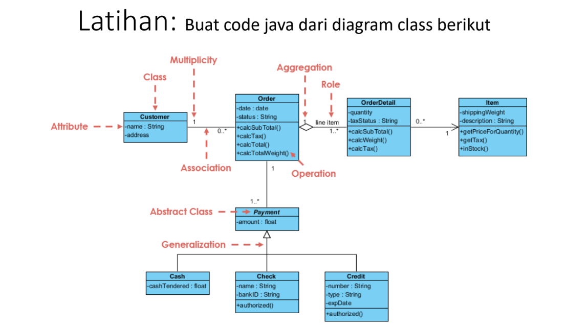

# Kardinalitas
## Praktikum Pertemuan Ke 11 Pemrograman Orientasi Objek.


<br>

| Variable           |             Isi            |
| -------------------|----------------------------|
| **Nama**           |         Fadil Aditya Adzima    |
| **NIM**            |          312310617         |
| **Kelas**          |          TI.23.A.6         |
| **Mata Kuliah**    |      Pemrograman Orientasi Objek     |
| **Dosen Pengampu** | Agung Nugroho S.kom, M.kom  |

<br> <br> <br>


 

<br> <br>

### File <b>Cash.java</b>

``` java
public class Cash extends Payment {
    public Cash(double amount) {
        super(amount);
    }

    @Override
    public String toString() {
        return "Cash : " + getAmount();
    }
}
```

1. <b>Kelas ```Cash```</b>: <br>
- Kelas ```Cash``` merupakan subclass dari kelas ```Payment```, yang berarti kelas ini mewarisi properti dan metode dari kelas ```Payment```. Dengan kata lain, kelas ini adalah turunan dari kelas ```Payment```. <br> <br>

2. <b>Konstruktor ```Cash(double amount)```</b>: <br>
- Kelas ```Cash``` memiliki sebuah konstruktor yang menerima satu argumen, yaitu ```amount``` bertipe ```double```. Di dalam konstruktor ini, digunakan perintah ```super(amount)``` yang memanggil konstruktor dari kelas induk (```Payment```), sehingga nilai ```amount``` akan dioper ke konstruktor kelas ```Payment```. Hal ini memungkinkan kelas ```Cash``` untuk mewarisi dan menggunakan atribut ```amount``` dari kelas ```Payment```. <br> <br>

3. <b>Metode ```toString()```</b>: <br>
- Metode ini merupakan override dari metode ```toString()``` di kelas induk (atau dari kelas ```Object``` jika tidak ada implementasi di kelas ```Payment```). Metode ini bertujuan untuk mengembalikan representasi string dari objek ```Cash```. <br>

- Ketika objek ```Cash``` dipanggil di dalam konteks string (misalnya ketika dicetak menggunakan ```System.out.println())```, metode ini akan dijalankan dan akan menghasilkan string berupa ```"Cash : "``` diikuti dengan nilai ```amount``` yang didapatkan dari metode ```getAmount()``` (yang kemungkinan ada di kelas ```Payment```). <br> <br>

4. <b>Fungsi ```getAmount()```</b>: <br>
- Walaupun tidak terlihat di dalam kode yang disediakan, tampaknya ada metode ```getAmount()``` yang didefinisikan di kelas ```Payment```. Metode ini digunakan untuk mengakses nilai ```amount``` yang diteruskan melalui konstruktor ```Cash```.

<br> <br>

### File <b>Check.java</b>

``` java
public class Check extends Payment {
    private String bankID;

    public Check(double amount, String bankID) {
        super(amount);
        this.bankID = bankID;
    }

    @Override
    public String toString() {
        return "BankID : " + bankID;
    }
}
```

1. <b>Kelas ```Check```</b>: <br>
- Kelas ```Check``` mewarisi kelas ```Payment```. Ini berarti kelas ```Check``` akan mendapatkan semua properti dan metode yang ada di kelas ```Payment```. <br>

- Kelas ini juga memperkenalkan properti baru yaitu ```bankID```, yang merepresentasikan identitas bank terkait dengan pembayaran menggunakan cek. <br> <br>

2. <b>Atribut ```bankID```</b>: <br>
- Atribut ```bankID``` bertipe ```String``` dan bersifat private, yang berarti hanya bisa diakses dari dalam kelas ```Check``` itu sendiri. <br> <br>

3. <b>Konstruktor ```Check(double amount, String bankID)```</b>: <br>
- Konstruktor ini menerima dua argumen: amount bertipe ```double``` dan ```bankID``` bertipe ```String```. <br>

- ```super(amount)``` dipanggil untuk mengirim nilai ```amount``` ke konstruktor kelas induk ```Payment```, sehingga nilai tersebut bisa digunakan oleh kelas induk. <br>

- ```this.bankID = bankID;``` menyimpan nilai ```bankID``` yang diberikan ke atribut ```bankID``` milik objek ```Check```. <br> <br>

4. <b>Metode ```toString()```</b>: <br>
- Metode ini adalah override dari metode ```toString()``` bawaan Java (dari kelas ```Object```). Metode ini mengembalikan representasi string dari objek ```Check```. <br>

- Dalam hal ini, metode mengembalikan string ```"BankID : "``` diikuti dengan nilai ```bankID```. Ketika objek ```Check``` digunakan dalam konteks string (seperti dalam ```System.out.println())```, representasi ini akan digunakan. <br> <br>

5. <b>Penggunaan ```getAmount()```</b>: <br>
- Sama seperti pada kelas ```Cash```, meskipun tidak terlihat di dalam kode ini, kelas ```Payment``` mungkin memiliki metode ```getAmount()``` untuk mengakses nilai ```amount``` yang diteruskan oleh konstruktor ```Check```.

<br> <br>

### File <b>Credit.java</b>

``` java
public class Credit extends Payment {
    private String expirationDate;

    public Credit(double amount, String expirationDate) {
        super(amount);
        this.expirationDate = expirationDate;
    }

    @Override
    public String toString() {
        return "Credit : expDate " + expirationDate;
    }
}
```

1. <b>Kelas ```Credit```</b>: <br>
- Kelas ini merupakan subclass dari kelas ```Payment```, yang berarti ```Credit``` mewarisi properti dan metode dari ```Payment```. <br>

- Kelas ini juga memperkenalkan atribut baru yang khusus untuk pembayaran kredit, yaitu ```expirationDate```, yang merepresentasikan tanggal kedaluwarsa dari kartu kredit. <br> <br>

2. <b>Atribut ```expirationDate```</b>: <br>
- Atribut ```expirationDate``` bertipe ```String``` dan bersifat private, yang berarti hanya dapat diakses dari dalam kelas ```Credit``` itu sendiri. <br> <br>

3. <b>Konstruktor ```Credit(double amount, String expirationDate)```</b>: <br>
- Konstruktor ini menerima dua parameter : ```amount``` bertipe ```double``` dan ```expirationDate``` bertipe ```String```. <br>

- Pada bagian ```super(amount)```, konstruktor memanggil konstruktor kelas induk ```Payment``` untuk menginisialisasi nilai ```amount``` dalam objek ```Credit```. <br>

- ```this.expirationDate = expirationDate;``` digunakan untuk menginisialisasi atribut ```expirationDate``` dengan nilai yang diberikan sebagai argumen. <br> <br>

4. <b>Metode ```toString()```</b>: <br>
- Metode ini adalah override dari metode ```toString()``` dalam kelas ```Object```. Fungsinya untuk menghasilkan representasi string dari objek ```Credit```. <br>

- Dalam hal ini, representasi string yang dihasilkan adalah ```"Credit : expDate "``` diikuti dengan nilai dari ```expirationDate```. <br>

- Saat objek ```Credit``` dipanggil dalam konteks string (misalnya melalui ```System.out.println())```, metode ini akan dijalankan dan menampilkan informasi tanggal kedaluwarsa kartu kredit. <br> <br>

5. <b>Kaitan dengan ```amount```di kelas ```Payment```</b>: <br>
- Seperti pada kelas lain yang mewarisi ```Payment```, meskipun ```amount``` dioper ke kelas induk, representasi string dalam metode ```toString()``` tidak mencantumkan nilai ```amount``` secara eksplisit. Jika ingin menambahkan nilai ```amount```, bisa dilakukan dengan memodifikasi metode ```toString()```.

<br> <br>

### File <b>Customer.java</b>

``` java
public class Customer {
    private String name;
    private String address;

    public Customer(String name, String address) {
        this.name = name;
        this.address = address;
    }

    public String getName() {
        return name;
    }

    public String getAddress() {
        return address;
    }

    @Override
    public String toString() {
        return "Nama : " + name + "\nAlamat : " + address;
    }
}
```

1. <b>Kelas ```Customer```</b>: <br>
- Kelas ini merepresentasikan sebuah entitas Customer (pelanggan) dengan dua atribut : ```name``` (nama) dan ```address``` (alamat). <br>

- Kelas ini menyediakan konstruktor untuk menginisialisasi data pelanggan serta beberapa metode untuk mengakses dan menampilkan data tersebut. <br> <br>

2. <b>Atribut ```name``` dan ```address```</b>: <br>
- Kelas ini memiliki dua atribut : <br>
```name``` (bertipe ```String```) : Menyimpan nama dari pelanggan.<br>
```address``` (bertipe ```String```) : Menyimpan alamat dari pelanggan. <br>

- Kedua atribut ini bersifat private, yang berarti hanya bisa diakses secara langsung dari dalam kelas ```Customer```. <br> <br>

3. <b>Konstruktor ```Customer(String name, String address)```</b>: <br>
- Konstruktor ini digunakan untuk menginisialisasi objek ```Customer``` dengan nilai ```name``` dan ```address``` yang diberikan sebagai parameter. <br>

- ```this.name = name;``` dan ```this.address = address;``` digunakan untuk mengisi atribut ```name``` dan ```address``` dengan nilai yang diterima melalui parameter. <br> <br>

4. <b>Metode ```getName()``` dan ```getAddress()```</b>: <br>
- Metode ```getName()``` mengembalikan nilai dari atribut ```name```, yaitu nama pelanggan. <br>

- Metode ```getAddress()``` mengembalikan nilai dari atribut ```address```, yaitu alamat pelanggan. <br>

- Kedua metode ini adalah metode akses (getter) yang memungkinkan pengguna dari kelas ini untuk mengambil nilai dari atribut yang bersifat private. <br> <br>

5. <b>Metode ```toString()```</b>: <br>
- Metode ini merupakan override dari metode ```toString()``` bawaan Java dan digunakan untuk memberikan representasi string dari objek ```Customer```. <br>

- Dalam hal ini, string yang dikembalikan menampilkan "Nama" dan "Alamat" pelanggan dengan format yang jelas, memisahkan nama dan alamat dengan baris baru (```\n```). <br>

- Saat objek ```Customer``` dipanggil dalam konteks string (seperti dalam ```System.out.println()```), metode ini akan menampilkan detail pelanggan. 

<br> <br>

### File <b>Item.java</b>

``` java
public class Item {
    private String name;

    public Item(String name) {
        this.name = name;
    }

    public String getName() {
        return name;
    }

    @Override
    public String toString() {
        return "Item : " + name;
    }

    int getPrice() {
        throw new UnsupportedOperationException("Not supported yet.");
    }
}
```

1. <b>Kelas ```Item```</b>: <br>
- Kelas ```Item``` digunakan untuk merepresentasikan sebuah item atau barang, dengan atribut utama name (nama item). <br>

- Kelas ini menyediakan konstruktor untuk menginisialisasi nama item, metode untuk mendapatkan nama item, serta metode yang belum diimplementasikan untuk mendapatkan harga item. <br> <br>

2. <b>Atribut ```Name```</b>: <br>
- Atribut ```name``` bertipe ```String``` dan bersifat private, yang berarti hanya bisa diakses dari dalam kelas ```Item```. <br>

- Atribut ini digunakan untuk menyimpan nama dari item yang dibuat. <br> <br>

3. <b>Konstruktor ```Item(String name)```</b>: <br>
- Konstruktor ini menerima parameter ```name``` bertipe ```String``` dan digunakan untuk menginisialisasi nama item. <br>

- ```this.name = name;``` digunakan untuk mengisi atribut ```name``` dengan nilai yang diterima dari argumen yang diberikan saat pembuatan objek ```Item```.<br> <br>

4. <b>Metode ```getName()```</b>: <br>
- Metode ini mengembalikan nilai dari atribut ```name```, yaitu nama item. <br>

- Fungsi ini berguna untuk mengambil nama item yang telah diset pada saat objek diciptakan. <br> <br>


